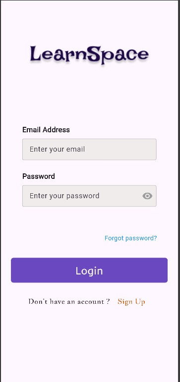
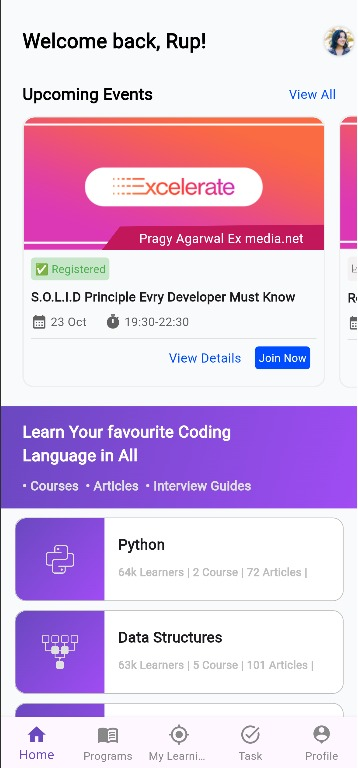
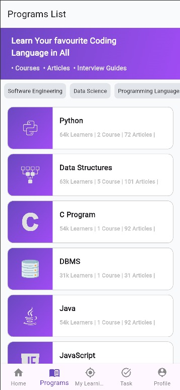
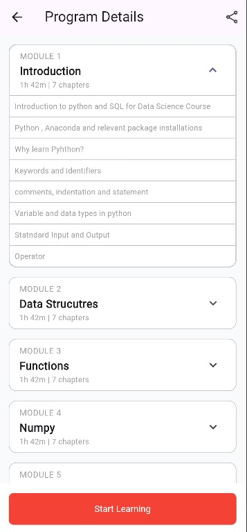

---

````markdown
# 📚 LearnSphere - LMS

A mobile-first Learning Management System (LMS) built with Flutter to simplify online education. LearnSphere enables learners to enroll in programs, track their progress, and stay updated through notifications.

---

## 🚀 Vision
**Simplify online education** by offering an intuitive and streamlined mobile LMS experience for learners.

---

## 🎯 Objectives
- Allow users to **browse and enroll** in educational programs.
- Enable learners to **track progress** through a friendly UI.
- Provide timely **notifications** and updates for enrolled users.
- Create a smooth, easy-to-navigate mobile learning journey.

---

## 🧭 Learner Navigation Flow

```text
Learner opens the app 
→ Logs in 
→ Browses programs 
→ Enrolls in a program 
→ Views progress 
→ Receives notifications
````

---

## 🔑 Key Features

* 🔐 **User Authentication** (Login/Signup)
* 📋 **Program Listing** (Explore available programs)
* 📝 **Enrollment System** (Join selected programs)
* 📊 **Progress Tracking** (Monitor course advancement)
* 🔔 **Notification System** (Stay informed with alerts)

---

## 📁 Folder Structure

```plaintext
learnsphere-lms/
│
├── lib/                             # All Dart code
│   ├── main.dart                    # App entry point
│   ├── blocks/                       # State management, business logic (e.g. BLoC, Cubits, controllers)
│   ├── models/                       # Data models/entities (e.g. Course, User, etc.)
│   ├── screens/                      # UI pages / views (Login, Home, Details, etc.)
│   ├── widgets/                      # Reusable UI components (buttons, cards, etc.)
│
├── assets/                           # Images, fonts, JSON, media files
├── pubspec.yaml                      # Flutter dependencies, assets declarations
├── README.md                         # Project documentation & overview
├── android/ …                        # Android-specific files (auto-generated by Flutter)
├── ios/ …                            # iOS-specific files
├── test/                             # Unit & widget tests  
└── … other Flutter project files …  

```

---

## 🛠️ Getting Started

To set up and run the project locally:

```bash
git clone https://github.com/sam-in07/LearnSphere.git
cd learnsphere-lms
flutter pub get
flutter run
```

---

## 🧪 Version Control

This project uses Git for version control.
✅ **Initial commit and push completed** to GitHub.

---

## 📎 Repository Link

🔗 [LearnSphere GitHub Repository](https://github.com/sam-in07/LearnSphere)

---


## 📊 GitHub Activity Tracker

🔗 [GitHub Tracker for LearnSphere](https://githubtracker.com/sam-in07/LEARNSPACE) `#Tracker`


---

## 📸 UI Screenshots (Week 2 Prototype)

### 🔐 Login Screen


---

### 🏠 Home Screen


---

### 📋 Program Listing Screen


---

### 📄 Program Details Screen


---

