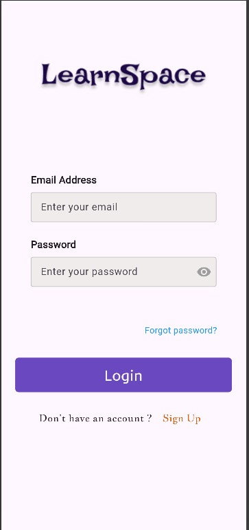
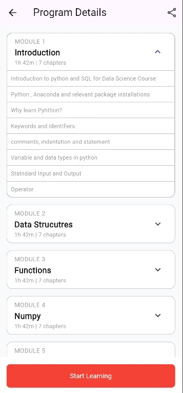

---

````markdown
# 📚 LearnSphere - LMS

A mobile-first Learning Management System (LMS) built with Flutter to simplify online education. LearnSphere enables learners to enroll in programs, track their progress, and stay updated through notifications.

---

## 🚀 Vision
**Simplify online education** by offering an intuitive and streamlined mobile LMS experience for learners.

---

## 🎯 Objectives
- Allow users to **browse and enroll** in educational programs.
- Enable learners to **track progress** through a friendly UI.
- Provide timely **notifications** and updates for enrolled users.
- Create a smooth, easy-to-navigate mobile learning journey.

---

## 🧭 Learner Navigation Flow

```text
Learner opens the app 
→ Logs in 
→ Browses programs 
→ Enrolls in a program 
→ Views progress 
→ Receives notifications
````

---

## 🔑 Key Features

* 🔐 **User Authentication** (Login/Signup)
* 📋 **Program Listing** (Explore available programs)
* 📝 **Enrollment System** (Join selected programs)
* 📊 **Progress Tracking** (Monitor course advancement)
* 🔔 **Notification System** (Stay informed with alerts)

---

## 📁 Folder Structure

```plaintext
learnsphere-lms/
│
├── lib/                             # All Dart code
│   ├── main.dart                    # App entry point
│   ├── blocks/                       # State management, business logic (e.g. BLoC, Cubits, controllers)
│   ├── models/                       # Data models/entities (e.g. Course, User, etc.)
│   ├── screens/                      # UI pages / views (Login, Home, Details, etc.)
│   ├── widgets/                      # Reusable UI components (buttons, cards, etc.)
│
├── assets/                           # Images, fonts, JSON, media files
├── pubspec.yaml                      # Flutter dependencies, assets declarations
├── README.md                         # Project documentation & overview
├── android/ …                        # Android-specific files (auto-generated by Flutter)
├── ios/ …                            # iOS-specific files
├── test/                             # Unit & widget tests  
└── … other Flutter project files …  

```

---

## 🛠️ Getting Started

To set up and run the project locally:

```bash
git clone https://github.com/sam-in07/LearnSphere.git
cd learnsphere-lms
flutter pub get
flutter run
```

---

## 🧪 Version Control

This project uses Git for version control.
✅ **Initial commit and push completed** to GitHub.

---

## 📎 Repository Link

🔗 [LearnSphere GitHub Repository](https://github.com/sam-in07/LearnSphere)

---


## 📊 GitHub Activity Tracker

🔗 [GitHub Tracker for LearnSphere](https://githubtracker.com/sam-in07/LEARNSPACE) `#Tracker`


---

## 📸 UI Screenshots (Week 2 Prototype)

### 🔐 Login Screen



---

### 🏠 Home Screen


---

### 📋 Program Listing Screen


---

### 📄 Program Details Screen


---


## 🧩 **README Update – Week 3**

### 🔥 Firebase Integration Setup

This project now uses **Firebase Firestore** to store and fetch program data dynamically for the **Program Listing Screen**.

#### **Steps to Set Up Firebase in Flutter**

1. Go to the [Firebase Console](https://console.firebase.google.com/).
2. Create a new project (or use an existing one).
3. Click **“Add App” → “Flutter”** and follow the on-screen instructions.
4. Download the `google-services.json` file and place it inside your Flutter project:

   ```
   android/app/google-services.json
   ```
5. Open your `pubspec.yaml` file and add the following dependencies:

   ```yaml
   dependencies:
     firebase_core: ^3.3.0
     cloud_firestore: ^5.4.4
   ```
6. Run the following commands to initialize Firebase:

   ```bash
   flutter pub get
   flutterfire configure
   ```
7. Initialize Firebase in your app by updating the main function:

   ```dart
   void main() async {
     WidgetsFlutterBinding.ensureInitialized();
     await Firebase.initializeApp();
     runApp(MyApp());
   }
   ```

---

### 📂 **Firestore Data Structure**

Firestore Collection: `programs`

Each document inside `programs` represents a course category (e.g., `data_structures`, `java`, `python`, etc.).

**Example Document:**

```json
{
  "program_name": "Data Structures",
  "logo_url": "assets/images/program_images/datastructure.png",
  "total_courses": "5",
  "total_learners": "63k"
}
```

---

### 💻 **Fetching and Displaying Data in Flutter**

The **Program Listing Screen** uses a `StreamBuilder` to fetch data in real time from Firestore.

**Example Code:**

```dart
import 'package:cloud_firestore/cloud_firestore.dart';
import 'package:flutter/material.dart';

class ProgramListingScreen extends StatelessWidget {
  @override
  Widget build(BuildContext context) {
    return Scaffold(
      appBar: AppBar(title: Text('Programs')),
      body: StreamBuilder<QuerySnapshot>(
        stream: FirebaseFirestore.instance.collection('programs').snapshots(),
        builder: (context, snapshot) {
          if (snapshot.connectionState == ConnectionState.waiting) {
            return Center(child: CircularProgressIndicator());
          } else if (snapshot.hasError) {
            return Center(child: Text('Error loading data'));
          }

          final programs = snapshot.data!.docs;

          return ListView.builder(
            itemCount: programs.length,
            itemBuilder: (context, index) {
              var data = programs[index].data() as Map<String, dynamic>;
              return Card(
                margin: EdgeInsets.all(8),
                child: ListTile(
                  leading: Image.asset(data['logo_url']),
                  title: Text(data['program_name']),
                  subtitle: Text(
                    '${data['total_courses']} Courses • ${data['total_learners']} Learners',
                  ),
                ),
              );
            },
          );
        },
      ),
    );
  }
}
```

---

### ⚙️ **Features Added This Week**

* Connected **Program Listing Screen** to Firestore.
* Replaced hardcoded data with live Firestore data.
* Added **loading indicators** and **error messages** for better user experience.
* Updated documentation and code comments for clarity.

---

### 📘 **Next Steps**

* Implement a **Program Details Screen** that displays specific course details for each program.
* Add user **feedback form** connected to the Firestore `feedback` collection.

---

